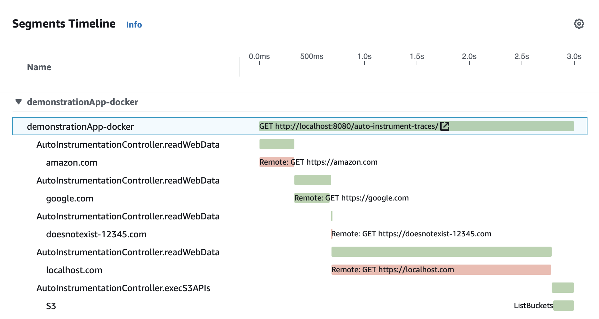

# Open Telemetry Spring Boot Sample Application
This repo contains a Sample Spring Boot Application instrumented with the AWS Distro for Open Telemetry (ADOT). The application can be run as a standard Java application or using a docker container. Further information on ADOT can be found here: 

https://aws-otel.github.io

## What does the app do?
When running the app, Spring's Embedded Tomcat will listen on Port `8080` (http://localhost:8080) and expose the following URL mappings:

* `http://localhost:8080/auto-instrument-traces/`
* `http://localhost:8080/business-metrics/`

The first mapping will prompt the sample app to connect to various URLs (some valid, some not), exercise some AWS APIs, and capture traces using Open Telemetry's automatic tracing capabilties and publish them to X-Ray.

The second URL will generate some business metrics and publish them to CloudWatch.

Additionally, the application will run a special method every 10 seconds and generate additional performance metrics which are also published to CloudWatch.

## What is the output?
The application mainly outputs Traces to X-Ray and Metrics to CloudWatch. Browsing to either of the two URLs will just trigger the process.

### Traces Output
Traces are stored using X-Ray. Here is a screenshot showing an example



### Metrics Output
Metrics are stored in this namespace:

```
com.hanegraaff.observability/demonstrationApp-docker
```

And contain both metrics produced by the sample app as well as metrics produced by default by Open Telemetry. Note that I have not found a way to disable all of the default onces since don't appear to be very useful.

The app publishes a total of three metrics using random values:

* A `transaction_count` count organized by `ProductType` and `PaymentType` dimensions
* A `response_time` organized by `ServiceName` and `Activity` dimensions
* A `temperature` metric organized by a `Location` Dimension

You can find the code [here](/java-open-telemetry/src/main/java/com/observability/demonstrationApp/controllers/ManualInstrumentationController.java)

## Running the sample app as a Docker container
The simplest way to run the sample app is to run it as a Docker container. Using this method, both the AWS ADOT Collector and the sample app will be run together using Docker Compose.

1. Build project and container:

    ```cmd
    >> build-docker.sh
    ```

2. Run the images:
    ```cmd
    >> run-docker.sh
    ```

## Running the sample app as a standalone Java App
Alternatively, you can run the sample application as standalone application. There is no difference in functionality no matter how you run the application.

1. Run the AWS OTEL Collector. The easiest way is to do so using in a Docker container:

    ```cmd
    >> docker pull amazon/aws-otel-collector

    >> docker run -p 4317:4317 -p 55680:55680 -p 8889:8888 \
      -e AWS_REGION=us-east-1 \
      -e AWS_PROFILE=default \
      -v ~/.aws:/root/.aws \
      amazon/aws-otel-collector
    ```

2. Build and run the sample application.

    ```
    >> build-n-run-local.sh
    ```

## Development Notes

1. The application relies on a Java Agent which is part of ADOT and is downloaded each time the artifact is build. You can see this inside `build-n-run-local.sh` and `docker-build.sh` The agent is used to provide automatic tracing capabilities.

    https://github.com/aws-observability/aws-otel-java-instrumentation/


2. The Agent does not require any special configuration, but when both the sample app and the collector are running inside Docker containers, it is configured to use `http://collector:4317` instead of `localhost`. This is configured inside [otel-docker-java-agent.properties](otel-docker-java-agent.properties) and is referenced inside the [dockerfile](dockerfile)
